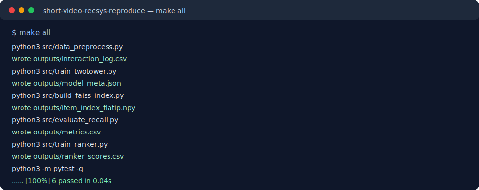
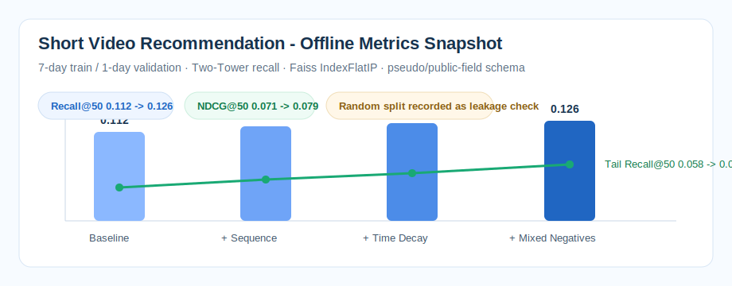

# Short Video Recommendation Reproduction

**Two-Tower Recall · Faiss TopK Retrieval · Time Split · Recall@50/NDCG@50 · Leakage Check**

## Background

This repository implements an offline short-video recommendation workflow for candidate generation, top-k retrieval evaluation, leakage checks, and experiment review.

**Public reproducible version; no private company data; no online A/B claim.**

## Dataset Boundary

This repository uses pseudo/anonymized data to reproduce the offline evaluation pipeline. It does not contain company data or online production code.

The public schema follows common short-video recommendation fields: user, item/video, exposure, click, finish, like, favorite, dwell time, author, category, and timestamp.

## Method

- build exposure-level recommendation samples with user, item, feedback, category, author, and timestamp fields
- build random, popular, same-category, and in-batch negative-sampling diagnostics
- train a DSSM / Two-Tower recall model with sampled-softmax and BCE-style training protocols
- build Faiss-style `IndexFlatIP` item retrieval and evaluate top-k candidate quality
- evaluate Recall@50, NDCG@50, AUC, and tail Recall@50 under a 7-day train / 1-day validation split
- run leakage checks, feature ablation, negative-sampling comparison, and random-split contrast
- output reproducible metrics, experiment tables, and badcase records for review

## Metrics

| Setup | Split | Recall@50 | NDCG@50 | Tail Recall@50 |
|---|---|---:|---:|---:|
| Two-Tower + mean pooling baseline | 7d train / 1d valid | 0.112 | 0.071 | 0.058 |
| + sequence + time decay + mixed negatives | 7d train / 1d valid | 0.126 | 0.079 | 0.071 |

## Ablation

The ablation table is available at [`ablation.csv`](ablation.csv) and [`experiments/ablation.csv`](experiments/ablation.csv). It records recent sequence, time decay, user-category crossing, and mixed negative sampling instead of attributing the lift to a vague "better model".

## Badcases

Badcase records are available at [`badcases.csv`](badcases.csv) and [`badcases/badcase_samples.csv`](badcases/badcase_samples.csv), covering head-item leakage risk, repeated author exposure, cold-start videos, and weak-negative noise.

## Run Snapshot



## Evidence Pack

For interview review, see [`evidence_pack/`](evidence_pack/). It contains project overview, data schema, metric definitions, experiment CSV, ablation CSV, badcases, run commands, boundary statement, and whiteboard notes.

## Experiment Coverage

This repo keeps the key artifacts needed to discuss a recommendation recall/ranking experiment end to end:

| Experiment Topic | Repository Artifact |
|---|---|
| exposure samples, user/item/time fields | `data_schema.md`, `src/data_preprocess.py`, pseudo `outputs/interaction_log.csv` |
| negative sampling diagnostics | `src/negative_sampling.py`, `outputs/negative_samples.csv`, `outputs/negative_sampling_summary.json` |
| 7-day train / 1-day validation | `data_schema.md`, `experiments/metrics.csv` |
| DSSM / Two-Tower | `src/train_twotower.py`, `outputs/model_meta.json` |
| Faiss IndexFlatIP top-k retrieval | `src/build_faiss_index.py`, `src/evaluate_recall.py` |
| Recall@50 / NDCG@50 / tail Recall@50 | `experiments/metrics.csv`, `assets/results_summary.md` |
| Feature ablation and leakage check | `experiments/ablation.csv`, `notebooks/data_distribution.ipynb` |
| Badcase review | `badcases/badcase_samples.csv` with 10 anonymized failure cases, `docs/interview_qa.md` |
| Metric snapshot | `assets/metrics_snapshot.svg`, `assets/results_summary.md` |

## Repository Structure

```text
.
├── README.md
├── data_schema.md
├── requirements.txt
├── src/
│   ├── data_preprocess.py
│   ├── negative_sampling.py
│   ├── train_twotower.py
│   ├── build_faiss_index.py
│   ├── evaluate_recall.py
│   └── train_ranker.py
├── experiments/
│   ├── metrics.csv
│   ├── generated_metrics.csv
│   └── ablation.csv
├── badcases/
│   └── badcase_samples.csv
├── notebooks/
│   └── data_distribution.ipynb
├── assets/
│   └── results_summary.md
└── outputs/
```

## How to Run

Recommended:

```bash
make all
```

Equivalent manual commands:

```bash
python3 src/data_preprocess.py
python3 src/negative_sampling.py
python3 src/train_twotower.py
python3 src/build_faiss_index.py
python3 src/evaluate_recall.py
python3 src/train_ranker.py
python3 -m pytest -q
```

The scripts are CPU-friendly and run on pseudo data. They are meant to demonstrate a credible experiment workflow, not to expose private platform data.

## What This Repo Proves

This repo proves that the offline recommendation evaluation chain is inspectable and runnable: data schema, time split, negative sampling diagnostics, Two-Tower training entry point, Faiss-style TopK retrieval, metrics, ablation records, and badcase analysis are all present.

## Offline Metrics Used in the Resume



| Setup | Split | Recall@50 | NDCG@50 | Tail Recall@50 | Note |
|---|---|---:|---:|---:|---|
| Two-Tower + mean pooling baseline | 7d train / 1d valid | 0.112 | 0.071 | 0.058 | ID/category/history baseline |
| + sequence + time decay + mixed negatives | 7d train / 1d valid | 0.126 | 0.079 | 0.071 | Main resume result |
| Same setup with random split | random split | 0.139 | 0.086 | 0.074 | Higher but not reported due to leakage risk |

## Evidence Files For Interview Review

| File | Why it matters |
|---|---|
| `data_schema.md` | Explains user/item/exposure/feedback/time fields and the public-field schema boundary. |
| `src/train_twotower.py` | Shows the Two-Tower training entry point and model metadata generation. |
| `src/build_faiss_index.py` | Shows the offline top-k retrieval path and `IndexFlatIP`-style evidence. |
| `experiments/metrics.csv` | Records baseline, sequence, time-decay, mixed-negative, and random-split comparison. |
| `experiments/ablation.csv` | Explains where the Recall@50 lift comes from instead of saying "model improved". |
| `badcases/badcase_samples.csv` | Keeps failure cases for head leakage, author repeat, cold start, and noisy negatives. |
| `docs/interview_qa.md` | Prepared answers for dataset source, loss, sampling, metrics, Faiss, and leakage questions. |
| `docs/experiment_log.md` | Human-readable experiment log with decisions, metrics, and risks. |
| `docs/dev_log.md` | Records how the public reproducible version is organized and what data boundary it follows. |
| `tests/` | Pytest checks for data split, metric consistency, and negative-sampling assumptions. |

## Key Interview Answers

### Where does the dataset come from?

This is an offline reproduction based on public short-video recommendation dataset field conventions. It is **not company-internal data**. Fields include user, item/video, exposure, click, finish, like, favorite, dwell time, author, category, and timestamp.

### Why time split?

Recommendation systems use past behavior to predict future feedback. Random split can leak future popularity and near-duplicate user behavior, making AUC look better. The resume only reports the 7-day train / 1-day validation split.

### What is inside the user tower?

User ID embedding, recent behavior sequence, category preference, author interaction, time-decay features, and history statistics.

### What is inside the item tower?

Video ID, author ID, category ID, publish time bucket, duration bucket, and content-side features. These help cold-start videos where pure ID embeddings are weak.

### Why Recall@50 instead of only AUC?

Two-Tower is a retrieval module. Its job is to place relevant candidates into top-k. AUC measures pairwise ranking quality, but it can hide head-item bias. Therefore Recall@50, NDCG@50, and tail Recall@50 are reported together.

### Why IndexFlatIP?

The offline candidate size is around 30k videos, so exact inner-product search is sufficient and avoids approximate-index noise. IVF/HNSW would be considered when the item scale grows to millions.

### What exactly improved Recall@50?

The strongest validated run did not come from a single magic model change. The lift came from adding recent behavior sequence, time decay, user-category preference crossing, author interaction features, and mixed weak negatives. The ablation log shows Recall@50 moving from `0.112 -> 0.119 -> 0.123 -> 0.125 -> 0.126`.

## What This Repo Does Not Claim

- The public version uses pseudo/anonymized data with field conventions aligned to public short-video recommendation datasets such as KuaiRec, KuaiRand, and Tenrec.
- It is not an online ByteDance/TikTok system.
- It does not contain private user data.
- It does not claim online A/B lift.
- It is a public reproducible version for recommendation retrieval/ranking discussion and code review.
